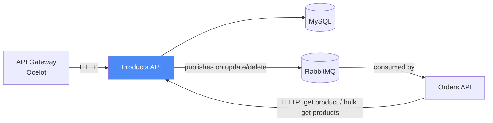

# Products Microservice — `products-api`

Product catalog service for the **eCommerce Microservices** system. Owns product data and publishes change events so downstream services can keep their caches in sync.

Part of a 5-repository microservices system. See the [organization](https://github.com/ym-harsha-ecommerce-microservices) for the full picture, or jump to the [API Gateway](https://github.com/ym-harsha-ecommerce-microservices/api-gateway) and [infrastructure](https://github.com/ym-harsha-ecommerce-microservices/ecommerce-infrastructure) repos.

    

## Where it fits



Every product update or delete fires a RabbitMQ event so `orders-api` can invalidate or refresh the copy it holds in Redis, instead of Orders having to poll or go stale.

## Tech stack

| Concern | Choice |
|---|---|
| Runtime | ASP.NET Core, **Minimal API** endpoints (not controllers) |
| Data access | Entity Framework Core |
| Database | MySQL |
| Validation | FluentValidation |
| Object mapping | AutoMapper |
| Messaging | RabbitMQ (publisher) |
| Containerization | Docker |
| Orchestration | Kubernetes (via `ecommerce-infrastructure`) |
| Testing | xUnit, Moq, AutoFixture (AutoMoq), FluentAssertions |

## Architecture

```
eCommerce.BLL/
├── DTOs/                          # ProductAddRequest, ProductUpdateRequest, ProductResponse
├── DTOs/RabbitMQMessages/           # ProductDeleteMessage, ProductNameUpdateMessage
├── Exceptions/                      # CustomValidationException
├── RabbitMQ/                        # IRabbitMQPublisher, RabbitMQPublisher, RabbitMQOptions
├── Services/Contracts/                # IProductService
└── Services/Implementations/           # ProductService

eCommerce.DAL/
├── Entities/                       # Product
└── Repositories/                    # IProductsRepository, ProductsRepository (EF Core)

eCommerce.API/
├── EndPoints/                      # ProductAPIEndpoints (Minimal API route group)
└── Middlewares/                     # ExceptionHandlingMiddleware
```

**Notable implementation choices:**
- **Minimal API over controllers.** Routes are grouped under `/api/products` with `.WithSummary()`/`.WithDescription()` for Swagger, rather than a `ProductsController` class — a deliberate contrast with the controller-based Users/Orders services, to get real hands-on time with both styles.
- **Validation is manual, not a pipeline.** `CreateProductAsync`/`UpdateProductAsync` explicitly call `IValidator<T>.ValidateAsync()` and throw a hand-rolled `CustomValidationException` (a `Dictionary<string, string[]>` of field errors) rather than adopting a MediatR/CQRS validation pipeline — kept intentionally simple and explicit.
- **Event publishing is conditional, not automatic.** `UpdateProductAsync` only fires a RabbitMQ `ProductNameUpdateMessage` when the product's name actually changed (`isProductNameChanged`), avoiding noise on updates that don't affect anything Orders has cached.
- RabbitMQ connection settings (host, credentials, exchange/queue/routing-key names) are read from `IOptions<RabbitMQOptions>`, itself populated from **Docker environment variables** rather than hardcoded — the same image runs against different brokers in different environments without a rebuild.

## API Endpoints

| Method | Route | Description |
|---|---|---|
| `GET` | `/api/products/` | Get all products |
| `GET` | `/api/products/search/product-id/{productId}` | Get a single product by ID |
| `GET` | `/api/products/products/search/{searchString}` | Search by category or product name |
| `POST` | `/api/products/search/product-ids` | Bulk fetch products by a list of IDs — used by `orders-api` |
| `POST` | `/api/products/` | Create a product |
| `PUT` | `/api/products/` | Update a product (fires a RabbitMQ event if the name changed) |
| `DELETE` | `/api/products/{productId}` | Delete a product (fires a RabbitMQ delete event) |

## Running locally

```bash
docker build -t products-api .
docker run -p 8081:8080 --env-file .env products-api
```

Requires a reachable MySQL instance and RabbitMQ broker — both are wired up in the shared `docker-compose` / Kubernetes manifests in [`ecommerce-infrastructure`](https://github.com/ym-harsha-ecommerce-microservices/ecommerce-infrastructure).

## Testing

```bash
dotnet test
```

Unit tests use **xUnit + Moq + AutoFixture (with `AutoMoqCustomization`) + FluentAssertions**, isolating `ProductService` from its repository, mapper, validators, and RabbitMQ publisher. Coverage includes:
- `CreateProductAsync` — null request, failing validation, repository failure, and the success path
- `DeleteProductAsync` / `UpdateProductAsync` — verifying the RabbitMQ publisher is called with the correct message and routing key **only** when it should be (e.g. `Times.Never` when the product name didn't change), using `IOptions<RabbitMQOptions>` wired to real routing-key values rather than mocked ones so the assertions check actual strings
- `GetAllProductsByConditionAsync` / `GetProductByConditionAsync` — condition-expression pass-through and not-found handling

## CI/CD

GitHub Actions builds, tests, and pushes a versioned image to **GitHub Container Registry** (`ghcr.io/.../ecommerce-products-api`) on every push to `main`. A self-hosted runner then applies the new image to the local Kubernetes cluster (`kubectl set image` + `rollout restart`). Full pipeline design lives in the [infrastructure repo](https://github.com/ym-harsha-ecommerce-microservices/ecommerce-infrastructure).

## Origin & Certification

Built while working through Harsha Vardhan's [.NET Microservices with Azure DevOps & AKS](https://www.udemy.com/course/dot-net-microservices-ecommerce-project-azure-devops-kubernetes-aks/) course. The Azure-specific parts of the pipeline (Azure DevOps, AKS, Azure Container Registry) were reimplemented on GitHub Actions + a self-hosted Kubernetes (Minikube) cluster + GitHub Container Registry — see the [infrastructure README](https://github.com/ym-harsha-ecommerce-microservices/ecommerce-infrastructure) for why.

🎓 **Certificate:** [Certificate link](https://drive.google.com/file/d/1VVxsmjJU57NlZn8QpqDcRlLGiE5nztiJ/view?usp=drive_link)
